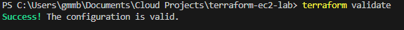
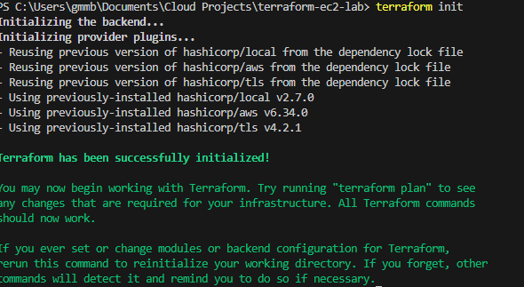
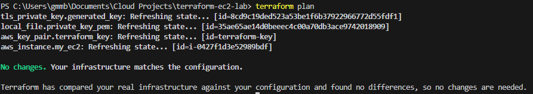
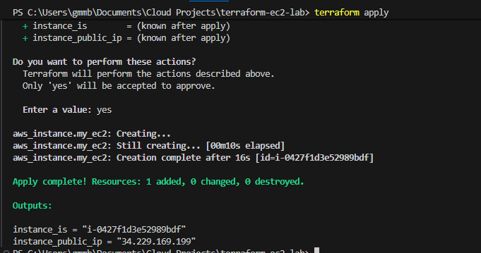
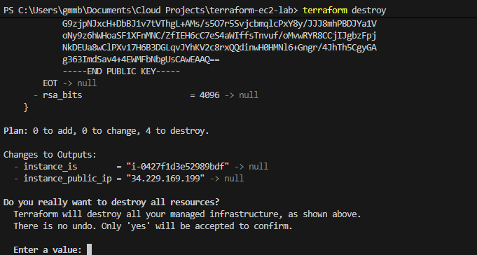
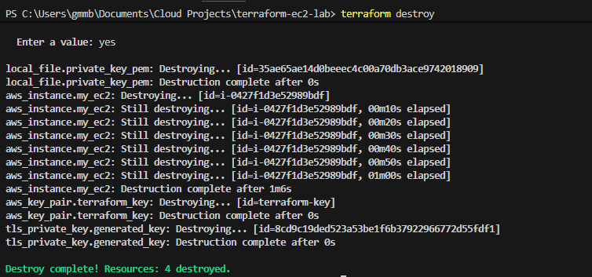

# Terraform EC2 Lab (AWS)

A small Terraform project to practice Infrastructure as Code by provisioning an EC2 instance with a security group (SSH access) on AWS.

## What this creates
- 1 EC2 instance
- 1 Security Group allowing SSH from a specified CIDR

---

## Prerequisites
- AWS account + credentials configured (AWS CLI)
- Terraform installed

---

## How to run
1. Clone repo
2. Copy example vars:
```bash
   cp terraform.tfvars.example terraform.tfvars
```

3. Format
```bash
    terraform fmt
```

4. Validate
```bash
    terraform validate
```



5. Initialize
```bash
   terraform init
```



6. Plan
```bash 
   terraform plan
```


7. Apply
```bash
    terraform apply
```


8. Cleanup

```bash
    terraform destroy
```





## Notes
- Do not commit terraform.tfvars, state files, or key pairs.


---

## Create a GitHub repo (web)
1. Go to GitHub → **New repository**
2. Name it something clean:
   - `terraform-ec2-lab` or `terraform-basics-ec2`
3. Keep it **Public** (best for recruiters)
4. Don’t add a README there if you already created one locally (avoid conflicts)

---

## Push your code from your computer (Windows PowerShell)
From inside your project folder:

```bash
    git init
    git add .
    git commit -m "Initial commit: Terraform EC2 lab"
    git branch -M main
    git remote add origin https://github.com/YOUR_USERNAME/YOUR_REPO_NAME.git
    git push -u origin main
```

---

## Final safety check (before pushing)
Run this to make sure you didn’t stage secrets:

```bash
    git status
```
# Make sure you dont see these files: 
```bash
    terraform.tfstate

    .terraform/

    .pem

    real terraform.tfvars with secrets
```